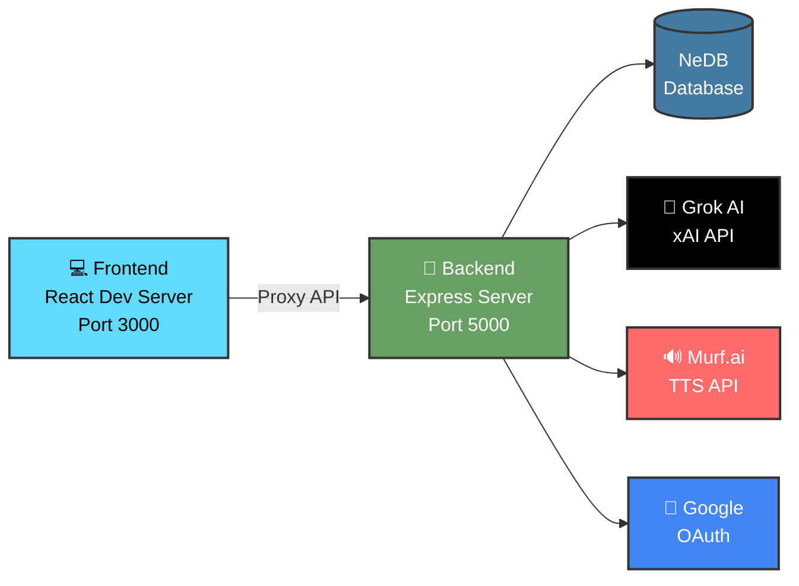
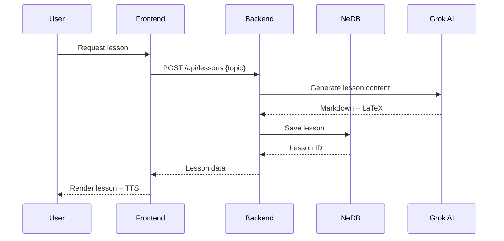

<div align="center">

# 🎓 EDUMENTOR

### *Gia Sư AI Cho Học Sinh THPT*

[](https://github.com/cuonghk1108/EDUMENTOR)
[](LICENSE)
[](https://nodejs.org/)
[](https://reactjs.org/)
[](https://github.com/cuonghk1108/EDUMENTOR/pulls)

**Học Tập Thông Minh • Công Nghệ AI • 100% Miễn Phí**

[🌐 Website](https://edumentor.io.vn) • [📖 Docs](#-tài-liệu-api) • [💬 Support](#-liên-hệ--hỗ-trợ) • [🐛 Report Issue](https://github.com/cuonghk1108/EDUMENTOR/issues)

---

### ✨ Tính Năng Nổi Bật

🎯 Bài Giảng Tương Tác • 📝 Quiz AI • 🔊 Text-to-Speech • 💬 Chatbot 24/7 • 📊 Học Tập Thông Minh

</div>

---

## 📑 Mục Lục

<details open>
<summary><b>Dành cho Học Sinh</b></summary>

- [🎯 Giới Thiệu](#-giới-thiệu)
- [✨ Tính Năng](#-tính-năng)
- [🚀 Bắt Đầu](#-bắt-đầu)
- [❓ FAQ](#-câu-hỏi-thường-gặp)
- [💬 Liên Hệ](#-liên-hệ--hỗ-trợ)

</details>

<details>
<summary><b>Dành cho Developer</b></summary>

- [🛠 Tech Stack](#-tech-stack)
- [🏗 Kiến Trúc](#-kiến-trúc-hệ-thống)
- [📦 Cài Đặt](#-cài-đặt--chạy-project)
- [⚙️ Cấu Hình](#️-cấu-hình-environment)
- [📁 Cấu Trúc](#-cấu-trúc-project)
- [🔌 API](#-api-documentation)
- [🤝 Contributing](#-contributing)

</details>

---

## 🎯 Giới Thiệu

> **EDUMENTOR** là nền tảng học tập thông minh sử dụng AI, giúp học sinh THPT Việt Nam học hiệu quả hơn với công nghệ tiên tiến.

### 🌟 Tại Sao Chọn EDUMENTOR?

<table>
<tr>
<td width="50%">

#### 📚 Học Mọi Lúc Mọi Nơi
- ✅ Không cần chờ thầy cô
- ✅ Học bất kỳ lúc nào trong ngày
- ✅ Giải đáp thắc mắc tức thì
- ✅ Luyện tập không giới hạn

</td>
<td width="50%">

#### 🎯 Cá Nhân Hóa 100%
- ✅ Lộ trình học cho riêng bạn
- ✅ Phân tích điểm yếu cá nhân
- ✅ Gợi ý bài học phù hợp
- ✅ Theo dõi tiến độ chi tiết

</td>
</tr>
<tr>
<td width="50%">

#### 🤖 AI Thông Minh
- ✅ Tạo bài giảng tự động
- ✅ Quiz được sinh ngẫu nhiên
- ✅ Chatbot giải thích chi tiết
- ✅ Âm thanh giọng tự nhiên

</td>
<td width="50%">

#### 💰 Hoàn Toàn Miễn Phí
- ✅ Không phí đăng ký
- ✅ Không giới hạn sử dụng
- ✅ Không quảng cáo làm phiền
- ✅ Không ẩn chi phí

</td>
</tr>
</table>

---

## ✨ Tính Năng

### 📖 Bài Giảng Tương Tác

<details open>
<summary><b>Click để xem chi tiết</b></summary>

<br>

```
📚 Nội dung được AI xử lý từ sách giáo khoa
├── ✍️ Lý thuyết dễ hiểu, logic rõ ràng
├── 🧮 Công thức toán học hiển thị đẹp (LaTeX)
├── 📌 Ví dụ minh họa thực tế
├── 📝 Bài tập luyện tập đa dạng
└── 💾 Tự động lưu tiến độ học
```

**Tính năng nổi bật:**
- 🎨 Giao diện thân thiện, dễ đọc
- 📱 Responsive, học trên mọi thiết bị
- 🔖 Đánh dấu phần quan trọng
- ✏️ Ghi chú cá nhân
- 📊 Theo dõi % hoàn thành

</details>

### 📝 Quiz & Kiểm Tra

<details open>
<summary><b>Click để xem chi tiết</b></summary>

<br>

| Tính năng | Mô tả |
|-----------|-------|
| 🤖 **Tự động sinh quiz** | AI tạo câu hỏi từ nội dung bài học |
| 🎲 **Đa dạng hình thức** | Trắc nghiệm, đúng/sai, điền khuyết |
| 💡 **Giải thích chi tiết** | Hiểu tại sao sai sau mỗi câu |
| ⚡ **Phản hồi tức thì** | Biết kết quả ngay lập tức |
| 📈 **Phân tích điểm yếu** | Gợi ý chủ đề cần ôn lại |
| 🔄 **Regenerate quiz** | Tạo mới đề khác để luyện thêm |

</details>

### 🔊 Text-to-Speech

<details>
<summary><b>Click để xem chi tiết</b></summary>

<br>

> Nghe bài giảng bằng giọng AI tự nhiên - Học mọi lúc mọi nơi!

**Tính năng:**
- 🎙️ Giọng đọc tiếng Việt tự nhiên
- ⏯️ Điều khiển phát/dừng/tua
- 🎚️ Tốc độ phát có thể điều chỉnh
- 💾 Cache audio để nghe offline
- 🚗 Học trên đường đi (hands-free)

**Use cases:**
```
🚶 Đi bộ/chạy bộ    →  Nghe bài giảng
🚌 Di chuyển         →  Ôn tập kiến thức
😴 Trước khi ngủ     →  Học nhẹ nhàng
👨‍🍳 Làm việc nhà      →  Học đa nhiệm
```

</details>

### 💬 Chatbot AI 24/7

<details>
<summary><b>Click để xem chi tiết</b></summary>

<br>

#### 🤖 Gia Sư AI Cá Nhân

**Chatbot có thể làm gì?**

✅ Giải đáp thắc mắc kiến thức  
✅ Hướng dẫn giải bài tập từng bước  
✅ Giải thích khái niệm khó hiểu  
✅ Gợi ý cách học hiệu quả  
✅ Hỗ trợ upload ảnh bài tập (OCR)  

**Đặc biệt:**
```python
# Chatbot hiểu cả tiếng Việt tự nhiên!
"Giải thích định luật bảo toàn năng lượng cho em hiểu đi"
"Bài toán này làm sao ạ?" + [đính kèm ảnh]
"Cho em cách nhớ bảng tan của sin cos"
```

</details>

### 🗺️ Lộ Trình Học Tập

<details>
<summary><b>Click để xem chi tiết</b></summary>

<br>

**Lộ trình cá nhân hóa theo mục tiêu:**

```mermaid
Chọn Mục Tiêu → AI Gợi Ý → Học Bài → Làm Quiz → Đánh Giá → Tiếp Tục
```

📌 **Các loại lộ trình:**
- 🎯 Luyện môn yếu
- 📖 Học theo chương SGK
- 🏆 Chuẩn bị thi THPT QG
- 🎓 Hướng nghiệp + tra điểm chuẩn

📊 **Dashboard theo dõi:**
- Tổng số bài đã học
- Điểm trung bình quiz
- Streak học liên tục
- Huy hiệu thành tích

</details>

### 🎮 Gamification

<details>
<summary><b>Click để xem chi tiết</b></summary>

<br>

| Feature | Icon | Mô tả |
|---------|------|-------|
| **Nhiệm vụ hàng ngày** | 🎯 | 5 nhiệm vụ để kiếm XP |
| **Huy hiệu** | 🏆 | 8 thành tích để mở khóa |
| **Streak** | 🔥 | Học liên tục nhiều ngày |
| **XP & Level** | ⭐ | Tăng cấp khi hoàn thành |
| **Leaderboard** | 📊 | So sánh với bạn bè |

**Daily Missions:**
- 📚 Hoàn thành 1 bài học → 50 XP
- ✅ Làm 3 quiz → 100 XP
- 🔥 Duy trì streak → 30 XP
- 💬 Hỏi AI 5 câu → 40 XP
- ⭐ Đạt điểm ≥80% → 150 XP

</details>

---

## � Cách Sử Dụng Cơ Bản

### 1️⃣ **Tạo Tài Khoản**
- Vào **edumentor.io.vn**
- Chọn **Đăng ký**
- Điền email, mất khẩu hoặc dùng Google
- Xong! Bắt đầu học tập

### 2️⃣ **Chọn Môn Học & Chủ Đề**
- Lần đầu tiên, em sẽ được chọn môn học quan tâm
- EDUMENTOR sẽ gợi ý bài giảng phù hợp
- Em cũng có thể tìm kiếm chủ đề cụ thể

### 3️⃣ **Học Bài Giảng**
- Đọc nội dung **từng phần**
- **Bấm ghi chú** khi thấy điều gì quan trọng
- **Nghe audio** phần khó để hiểu rõ hơn
- Mở **công thức** để xem chi tiết

### 4️⃣ **Làm Quiz & Kiểm Tra**
- Sau mỗi bài giảng, em làm quiz
- **Chọn đáp án** và **nộp bài**
- Nếu sai, **xem giải thích** để hiểu
- Điểm số sẽ lưu lại trong lịch sử

### 5️⃣ **Hỏi Chatbot Khi Cần**
- Click vào **biểu tượng chat** ở góc màn hình
- **Gõ câu hỏi** bất kỳ lúc nào
- Chatbot sẽ **trả lời chi tiết từng bước**

### 6️⃣ **Xem Lộ Trình Cá Nhân**
- Trong tab **Lộ Trình**, em sẽ thấy:
  - Bài đã học, bài tiếp theo
  - Thời gian dự kiến học
  - Mục tiêu cuối cùng
  - Gợi ý hướng nghiệp

---

## ❓ FAQ - Câu Hỏi Thường Gặp

<details>
<summary><b>🤔 Có phải trả tiền không?</b></summary>

<br>

Hiện tại **EDUMENTOR hoàn toàn MIỄN PHÍ** cho học sinh! 🎉

| Tính Năng | Free | Premium (Tương Lai) |
|-----------|:----:|:-------------------:|
| Tạo bài giảng AI | ✅ 10/ngày | ✅ Không giới hạn |
| Quiz tự động | ✅ | ✅ |
| Chatbot 24/7 | ✅ 50 tin/ngày | ✅ Không giới hạn |
| Text-to-Speech | ✅ | ✅ + giọng cao cấp |
| OCR upload ảnh | ✅ 10/ngày | ✅ Không giới hạn |
| Lộ trình cá nhân | ✅ | ✅ + AI coach |

> **Cam kết:** Phiên bản cơ bản sẽ luôn miễn phí! 💙

</details>

<details>
<summary><b>📱 Có app mobile không?</b></summary>

<br>

**Đang phát triển!** 🚧

- ✅ **Web responsive:** Truy cập qua trình duyệt điện thoại
- ⏳ **Android App:** Đang thử nghiệm beta
- ⏳ **iOS App:** Coming soon 2026

Đăng ký email để nhận thông báo khi app ra mắt!

</details>

<details>
<summary><b>🔒 Dữ liệu của em có an toàn không?</b></summary>

<br>

**Bảo mật tuyệt đối!** 🛡️

✅ Mật khẩu được **hash với bcrypt**  
✅ HTTPS/SSL encryption  
✅ JWT authentication  
✅ Không bán dữ liệu cho bên thứ ba  
✅ Tuân thủ GDPR và CCPA  

</details>

<details>
<summary><b>🤖 AI có trả lời sai không?</b></summary>

<br>

**AI rất thông minh nhưng không hoàn hảo 100%!**

| Tình Huống | Giải Pháp |
|------------|----------|
| Câu trả lời sai | ✅ Hệ thống kiểm tra chéo với nhiều nguồn |
| Công thức toán nhầm | ✅ Sử dụng Wolfram Alpha API backup |
| Thông tin lỗi thời | ✅ Cập nhật kiến thức định kỳ |
| Không hiểu câu hỏi | ✅ Chatbot yêu cầu làm rõ |

**Mẹo:** Nếu nghi ngờ, hỏi lại hoặc tham khảo thêm sách giáo khoa! 📚

</details>

<details>
<summary><b>📚 Có đủ nội dung cho tất cả môn không?</b></summary>

<br>

**Hiện tại hỗ trợ:**

| Môn Học | Lớp | Trạng Thái |
|---------|-----|:----------:|
| 🧮 Toán | 10-12 | ✅ Đầy đủ |
| ⚗️ Hóa Học | 10-12 | ✅ Đầy đủ |
| ⚛️ Vật Lý | 10-12 | ✅ Đầy đủ |
| 🧬 Sinh Học | 10-12 | ✅ Đầy đủ |
| 🌍 Địa Lý | 10-12 | ⏳ Đang cập nhật |
| 📜 Lịch Sử | 10-12 | ⏳ Đang cập nhật |
| 🇬🇧 Tiếng Anh | 10-12 | ⏳ Đang cập nhật |
| 📝 Văn | 10-12 | ⏳ Đang cập nhật |

**AI có thể tạo bài giảng cho bất kỳ môn nào, nhưng độ chính xác cao nhất với môn khoa học tự nhiên.**

</details>

<details>
<summary><b>🌐 Có cần internet không?</b></summary>

<br>

**Có, EDUMENTOR yêu cầu kết nối internet ổn định.**

📊 **Dung lượng data:**
- 📄 Xem bài giảng: ~500 KB/bài
- 💬 Chat AI: ~100 KB/tin nhắn
- 🔊 TTS audio: ~1-2 MB/bài (có cache)
- 📷 Upload ảnh OCR: ~500 KB-2 MB/ảnh

💡 **Tip:** Kết nối WiFi để tiết kiệm data khi nghe TTS!

</details>

<details>
<summary><b>📝 Chatbot có hiểu tiếng lóng không?</b></summary>

<br>

**Chatbot AI hiểu tiếng Việt tự nhiên!** 🎯

✅ Em có thể hỏi theo phong cách của mình  
✅ AI nhận diện "slang" phổ biến  
✅ Trả lời bằng ngôn ngữ học thuật chuẩn  
✅ Giải thích theo cách dễ hiểu  

```python
# Ví dụ
Em: "Bài này khó vãi, giải thích đi"
AI: "Mình hiểu bài này khó. Để mình phân tích từng bước nhé..."
```

</details>

<details>
<summary><b>🐛 Gặp lỗi thì làm sao?</b></summary>

<br>

**Quy trình báo lỗi:**

1. 📸 Chụp ảnh màn hình lỗi
2. 📝 Mô tả ngắn gọn bước tái hiện
3. 📧 Gửi email: support@edumentor.io.vn
4. ⏰ **Nhận phản hồi trong 24h**

**Hoặc:**
- 🐞 Dùng nút "Báo lỗi" trong app
- 💬 Nhắn qua Facebook page
- 🐙 Mở issue trên GitHub

</details> 

---

## 📞 Liên Hệ & Hỗ Trợ

<div align="center">

[](https://edumentor.io.vn)
[](mailto:support@edumentor.io.vn)
[](https://github.com/cuongdev1108/AI-Tutor)
[](https://facebook.com)

</div>

<br>

<div align="center">

### 💬 Các Kênh Hỗ Trợ

| Kênh | Mục Đích | Thời Gian Phản Hồi |
|------|----------|-------------------|
| 📧 **Email** | Báo lỗi, góp ý | < 24 giờ |
| 💬 **In-app Chat** | Hỏi đáp nhanh | Ngay lập tức (AI) |
| 🐙 **GitHub Issues** | Bug reports | < 48 giờ |
| 👥 **Facebook** | Cộng đồng, tin tức | Mỗi ngày |

</div>

<br>

<div align="center">

---

### 🌟 **EDUMENTOR – Học thông minh, giỏi hơn mỗi ngày!** 🚀

*Nếu EDUMENTOR giúp em học tập tốt hơn, hãy chia sẻ với bạn bè nhé!* 💪

[](https://facebook.com)  
[](https://zalo.me)

---

### 📄 Thông Tin Pháp Lý

[](https://opensource.org/licenses/MIT)

**MIT License © 2026 cuongdev1108**

*Nền tảng được phát triển nhằm hỗ trợ giáo dục miễn phí cho học sinh THPT Việt Nam.* 🇻🇳

</div>

---

---

# 👨‍💻 DÀNH CHO DEVELOPER

## 🛠 Công Nghệ Sử Dụng

<div align="center">

### Frontend Stack


### Backend Stack


### AI & Services


</div>

<details>
<summary><b>📚 Chi Tiết Công Nghệ</b></summary>

<br>

### Frontend

| Công Nghệ | Phiên Bản | Mục Đích |
|----------|----------|----------|
| **React** | 18.x | Thư viện UI chính |
| **TailwindCSS** | 3.x | Styling responsive |
| **Framer Motion** | 10.x | Animations & transitions |
| **KaTeX** | 0.16+ | Hiển thị công thức LaTeX |
| **remark-math** | 5.x | Parse toán học trong Markdown |
| **@react-oauth/google** | 0.11+ | Đăng nhập Google |
| **Axios** | 1.x | HTTP client |
| **React Router** | 6.x | Routing & navigation |

### Backend

| Công Nghệ | Phiên Bản | Mục Đích |
|----------|----------|----------|
| **Node.js** | 18+ | JavaScript runtime |
| **Express.js** | 4.x | Web framework |
| **JWT** | 9.x | Xác thực token |
| **bcrypt** | 5.x | Hash mật khẩu |
| **NeDB** | 1.8+ | Lightweight NoSQL DB |
| **Multer** | 1.4+ | File upload middleware |
| **Tesseract.js** | 4.x | OCR tiếng Việt |
| **CORS** | 2.x | Cross-origin resource sharing |

### AI & Dịch Vụ Ngoài

| Dịch Vụ | Mục Đích |
|---------|----------|
| **Grok AI (xAI)** | Tạo bài giảng, quiz, chatbot |
| **Murf.ai** | Text-to-Speech giọng Việt |
| **Google OAuth** | Xác thực nhanh chóng |
| **Cloudflare Tunnel** | Expose server ra internet |
| **Wolfram Alpha** | Backup kiểm tra công thức toán |

### Optional: Background Jobs

| Công Nghệ | Phiên Bản | Mục Đích |
|----------|----------|----------|
| **Python** | 3.10+ | Worker runtime |
| **Celery** | 5.x | Task queue |
| **Redis** | 7.x | Message broker & cache |
| **FastAPI** | 0.100+ | Worker API |

</details>

---

## 🏗 Kiến Trúc Hệ Thống

### 🛠️ Development Mode (2 servers)



**Usage:**
```bash
# Terminal 1
cd frontend
npm start  # http://localhost:3000

# Terminal 2
cd backend
npm start  # http://localhost:5000
```

---

### 🚀 Production Mode (Unified)

```mermaid
graph TB
    A[🌐 User Browser] -->|HTTPS| B[Cloudflare Tunnel]
    B --> C[🔌 Backend Server<br/>Express Port 5000]
    C -->|Serves| D[📦 Frontend Build<br/>/frontend/build]
    C -->|API Routes| E[/api endpoints]
    E --> F[(NeDB)]
    E --> G[🤖 Grok AI]
    E --> H[🔊 Murf.ai]
    E --> I[🔐 Google OAuth]
    
    style A fill:#4285F4,stroke:#333,stroke-width:2px,color:#fff
    style B fill:#F38020,stroke:#333,stroke-width:2px,color:#fff
    style C fill:#68a063,stroke:#333,stroke-width:2px,color:#fff
    style D fill:#61dafb,stroke:#333,stroke-width:2px,color:#000
    style E fill:#FFD700,stroke:#333,stroke-width:2px,color:#000
```

**Deployment:**
```bash
# Build frontend
cd frontend
npm run build

# Start unified server
cd ../backend
npm start

# Access at: https://edumentor.io.vn
```

---

### 🔄 Data Flow Architecture



---

## 📦 Cài Đặt & Chạy

### Yêu Cầu
- Node.js ≥ 18
- npm ≥ 9
- Windows/Mac/Linux

### 1. Clone Repository
```bash
git clone https://github.com/cuongdev1108/AI-Tutor.git
cd AI-Tutor
```

### 2. Cài Đặt Backend
```bash
cd backend
npm install
```

### 3. Cài Đặt Frontend
```bash
cd ../frontend
npm install
```

### 4. Tạo File Biến Môi Trường
```bash
cd ../backend
# Sao chép .env.example thành .env
copy .env.example .env
# Hoặc trên macOS/Linux:
# cp .env.example .env
```

### 5. Chạy Development (2 Terminal)

**Terminal 1 - Backend:**
```bash
cd backend
npm start
# Server chạy tại http://localhost:5000
```

**Terminal 2 - Frontend:**
```bash
cd frontend
npm start
# App chạy tại http://localhost:3000
```

### 6. Build Production
```bash
# Build frontend
cd frontend
npm run build

# Chạy backend (serve frontend + API)
cd ../backend
npm start

# Truy cập tại http://localhost:5000
```

---

## ⚙️ Biến Môi Trường

### Backend – `backend/.env`

```env
# Server
PORT=5000
NODE_ENV=development

# JWT Authentication
JWT_SECRET=your_super_secret_jwt_key_here
JWT_EXPIRES_IN=7d

# Grok AI (xAI)
XAI_API_KEY=your_xai_api_key_from_console_dot_ai
XAI_MODEL=grok-beta

# Murf.ai (Text-to-Speech)
MURF_API_KEY=your_murf_api_key

# Google OAuth
GOOGLE_CLIENT_ID=your_client_id.apps.googleusercontent.com

# CORS & URLs
FRONTEND_URL=http://localhost:3000
PRODUCTION_URL=https://edumentor.io.vn

# File Upload
UPLOAD_DIR=./uploads
MAX_FILE_SIZE=10485760

# Optional: Celery / Redis
CELERY_API_URL=http://localhost:8001
INTERNAL_API_TOKEN=your_internal_token
REDIS_URL=redis://localhost:6379
```

### Frontend – `frontend/.env`

```env
# API Endpoint
REACT_APP_API_URL=http://localhost:5000/api
# Production: REACT_APP_API_URL=/api

# Google OAuth
REACT_APP_GOOGLE_CLIENT_ID=your_client_id.apps.googleusercontent.com
```

---

## 🔐 Thiết Lập Google OAuth

1. **Google Cloud Console:**
   - Vào https://console.cloud.google.com/
   - Create OAuth 2.0 Client ID (Web application)

2. **Authorized Origins:**
   ```
   http://localhost:3000
   http://localhost:5000
   https://edumentor.io.vn
   ```

3. **Copy Client ID vào:**
   - Backend: `GOOGLE_CLIENT_ID`
   - Frontend: `REACT_APP_GOOGLE_CLIENT_ID`

4. **Build frontend nếu chạy production:**
   ```bash
   npm run build
   ```

---

## 🌐 Cloudflare Tunnel Setup

### Tệp: `cloudflare/config.yml`

```yaml
tunnel: your_tunnel_uuid
credentials-file: ~/.cloudflared/your_tunnel_uuid.json

ingress:
  - hostname: edumentor.io.vn
    service: http://localhost:5000
  
  - service: http_status:404
```

### Chạy Tunnel:
```bash
cloudflared tunnel --config cloudflare/config.yml run
```

---

## 👨‍💼 Admin Setup

### Tạo Tài Khoản Admin Đầu Tiên

```bash
cd backend
node create-admin.js
```

**Credentials mặc định:**
- Email: `admin@edumentor.io.vn`
- Password: `Admin@123456`

Sau đó đăng nhập tại `/admin` và thay đổi mật khẩu.

---

## 📁 Cấu Trúc Dự Án

```
AI-Tutor/
├── backend/
│   ├── controllers/              # Logic xử lý
│   │   ├── authController.js
│   │   ├── lessonController.js
│   │   ├── quizController.js
│   │   ├── chatController.js
│   │   ├── adminController.js
│   │   └── ...
│   ├── routes/                   # API endpoints
│   ├── services/                 # Business logic
│   │   ├── aiService.js         # Grok AI integration
│   │   ├── ocrService.js        # OCR Tesseract
│   │   ├── murfService.js       # Text-to-Speech
│   │   └── ...
│   ├── middleware/               # Auth, upload, etc
│   ├── database/                 # NeDB data files
│   ├── uploads/                  # User uploaded files
│   ├── server.js                 # Entry point
│   ├── package.json
│   └── .env
│
├── frontend/
│   ├── public/
│   ├── src/
│   │   ├── pages/               # React pages
│   │   │   ├── Dashboard.js
│   │   │   ├── Lessons.js
│   │   │   ├── Chat.js
│   │   │   ├── Quiz.js
│   │   │   └── ...
│   │   ├── components/          # Reusable components
│   │   │   ├── Layout.js
│   │   │   ├── MathRenderer.js  # LaTeX rendering
│   │   │   ├── StructuredLesson.js
│   │   │   └── ...
│   │   ├── context/             # React Context (Auth, etc)
│   │   ├── services/            # API calls
│   │   ├── App.js
│   │   └── index.js
│   ├── package.json
│   ├── .env
│   └── build/                   # Production build
│
├── celery/                       # Optional: Background jobs
│   ├── celery_app.py
│   ├── tasks.py
│   ├── worker_api.py
│   ├── requirements.txt
│   └── .env
│
├── cloudflare/                   # Tunnel config
│   └── config.yml
│
├── README.md
├── LICENSE
└── start.bat                     # Start all services (Windows)
```

---

## 🔌 API Documentation

<div align="center">

**Base URL (Dev):** `http://localhost:5000/api`  
**Base URL (Prod):** `https://edumentor.io.vn/api`

</div>

### 🔒 Authentication Headers

```http
Authorization: Bearer <your_jwt_token>
Content-Type: application/json
```

---

### 👤 Auth Endpoints

<details>
<summary><b>Click để xem chi tiết</b></summary>

<br>

| Method | Endpoint | Mô Tả |
|--------|----------|-------|
| `POST` | `/auth/register` | Đăng ký tài khoản |
| `POST` | `/auth/login` | Đăng nhập email/password |
| `POST` | `/auth/google` | Đăng nhập OAuth Google |
| `POST` | `/auth/refresh` | Làm mới JWT token |
| `POST` | `/auth/forgot-password` | Quên mật khẩu |
| `POST` | `/auth/reset-password` | Đặt lại mật khẩu |

**Example Request:**
```bash
curl -X POST http://localhost:5000/api/auth/login \
  -H "Content-Type: application/json" \
  -d '{
    "email": "student@example.com",
    "password": "password123"
  }'
```

**Example Response:**
```json
{
  "success": true,
  "token": "eyJhbGciOiJIUzI1NiIsInR5cCI6IkpXVCJ9...",
  "user": {
    "id": "user123",
    "email": "student@example.com",
    "name": "Nguyễn Văn A"
  }
}
```

</details>

---

### 📚 Lesson Endpoints

<details>
<summary><b>Click để xem chi tiết</b></summary>

<br>

| Method | Endpoint | Mô Tả |
|--------|----------|-------|
| `GET` | `/lessons` | Danh sách bài học của user |
| `GET` | `/lessons/:id` | Chi tiết bài học |
| `POST` | `/lessons` | Tạo bài học mới (AI) |
| `POST` | `/lessons/:id/complete` | Đánh dấu hoàn thành |
| `DELETE` | `/lessons/:id` | Xóa bài học |

**Create Lesson Example:**
```bash
curl -X POST http://localhost:5000/api/lessons \
  -H "Authorization: Bearer <token>" \
  -H "Content-Type: application/json" \
  -d '{
    "topic": "Định luật Newton",
    "subject": "Vật Lý",
    "level": "Lớp 10"
  }'
```

</details>

---

### ✅ Quiz Endpoints

<details>
<summary><b>Click để xem chi tiết</b></summary>

<br>

| Method | Endpoint | Mô Tả |
|--------|----------|-------|
| `GET` | `/quiz` | Danh sách quiz của user |
| `POST` | `/quiz/generate` | Tạo quiz AI từ bài giảng |
| `POST` | `/quiz/:id/submit` | Nộp bài quiz |
| `GET` | `/quiz/:id/results` | Kết quả quiz |

</details>

---

### 💬 Chat Endpoints

<details>
<summary><b>Click để xem chi tiết</b></summary>

<br>

| Method | Endpoint | Mô Tả |
|--------|----------|-------|
| `POST` | `/chat` | Gửi tin nhắn chatbot |
| `POST` | `/chat/upload` | Upload ảnh bài tập (OCR) |
| `GET` | `/chat/history` | Lịch sử chat |

</details>

---

### 🔊 TTS Endpoints

<details>
<summary><b>Click để xem chi tiết</b></summary>

<br>

| Method | Endpoint | Mô Tả |
|--------|----------|-------|
| `POST` | `/tts` | Tạo audio từ text |
| `GET` | `/tts/audio/:filename` | Lấy file audio |

</details>

---

### 🎯 Career Endpoints

<details>
<summary><b>Click để xem chi tiết</b></summary>

<br>

| Method | Endpoint | Mô Tả |
|--------|----------|-------|
| `GET` | `/career/diem-chuan` | Tra cứu điểm chuẩn đại học |
| `GET` | `/career/roadmap` | Lộ trình hướng nghiệp |

</details>

---

## 🚀 Roadmap

<div align="center">

### 🛣️ Lộ Trình Phát Triển

</div>

### ✅ Hoàn Thành (2024)

<details open>
<summary><b>Xem các tính năng đã launch</b></summary>

<br>

| Feature | Status | Release Date |
|---------|:------:|:------------:|
| 📚 Bài giảng tương tác từ SGK | ✅ | Jan 2024 |
| 📷 OCR & công thức toán học | ✅ | Jan 2024 |
| ✅ Quiz tự động + giải thích | ✅ | Feb 2024 |
| 🔊 TTS + cache audio | ✅ | Feb 2024 |
| 💬 Chatbot hỏi đáp 24/7 | ✅ | Feb 2024 |
| 🔐 Google OAuth login | ✅ | Mar 2024 |
| 🔀 Hợp nhất backend + frontend | ✅ | Mar 2024 |
| 🌐 Cloudflare & domain production | ✅ | Mar 2024 |
| ✨ Animations & UI tương tác | ✅ | Mar 2024 |
| 🎮 Gamification (badges, XP, missions) | ✅ | Apr 2024 |
| 📈 Dashboard & analytics | ✅ | Apr 2024 |
| 📅 Daily tracking system | ✅ | Feb 2025 |

</details>

---

### 🛠️ Đang Phát Triển (2025)

<details open>
<summary><b>Xem các tính năng đang code</b></summary>

<br>

| Feature | Progress | ETA |
|---------|:--------:|:-----:|
| 📱 Mobile app (React Native) | 🟡🟡🟡⬜⬜ 60% | May 2025 |
| 🌐 PWA & offline mode | 🟡🟡⬜⬜⬜ 40% | Jun 2025 |
| 📈 Advanced analytics dashboard | 🟡🟡⬜⬜⬜ 40% | Jun 2025 |
| 🏆 Leaderboard & competitive mode | 🟡⬜⬜⬜⬜ 20% | Jul 2025 |
| 🎓 Lớp học & quản lý thầy cô | 🟡⬜⬜⬜⬜ 20% | Jul 2025 |

</details>

---

### 📝 Kế Hoạch Tương Lai (2025-2026)

<details>
<summary><b>Xem tính năng sắp tới</b></summary>

<br>

📹 **Video giảng bài**
- AI tạo video giảng bài tự động
- Subtitle tiếng Việt
- Interactive timestamps

🎥 **Live class integration**
- Video conferencing
- Whiteboard tương tác
- Screen sharing

🤜 **Competitive mode**
- Real-time quiz battles
- Tournament system
- Prizes & rewards

🏫 **School system integration**
- Liên kết với trường học
- Export báo cáo tiến độ
- Integration với LMS

🤖 **AI Voice Tutor**
- Chat bằng giọng nói
- Voice commands
- Natural conversation

🎮 **VR/AR Learning**
- 3D models for science
- Virtual lab experiments
- Immersive learning

</details>

---

## 🐛 Troubleshooting

### Backend không start
```bash
# Kiểm tra port 5000 đã được sử dụng
netstat -an | grep 5000

# Kill process nếu cần
lsof -ti:5000 | xargs kill -9
```

### Frontend build failed
```bash
# Clear cache & reinstall
rm -rf node_modules package-lock.json
npm install
npm run build
```

### LaTeX không render
- Kiểm tra `MathRenderer.js` – phải import `remarkMath` trong markdown processor
- Verify `KaTeX` được include

### OCR Tesseract error
```bash
# Cài lại packages
npm install tesseract.js
```

---

## 📝 Development Notes

### Commit Convention
```
feat: New feature
fix: Bug fix
docs: Documentation
style: Code style
refactor: Code refactor
perf: Performance
test: Tests
```

**Example:**
```
feat: add lesson AI generation
docs: update README for developers
fix: LaTeX formula rendering issue
```

---

## 🤝 Contribution Guidelines

<div align="center">

[](http://makeapullrequest.com)
[](https://www.firsttimersonly.com/)

</div>

### 👨‍💻 How to Contribute

<details>
<summary><b>Step-by-step guide</b></summary>

<br>

**1. Fork Repository**
```bash
# Click "Fork" button on GitHub
```

**2. Clone Your Fork**
```bash
git clone https://github.com/YOUR_USERNAME/AI-Tutor.git
cd AI-Tutor
```

**3. Create Feature Branch**
```bash
git checkout -b feature/amazing-feature
# or
git checkout -b fix/bug-fix
```

**4. Make Changes**
```bash
# Edit files
# Test your changes
```

**5. Commit with Convention**
```bash
git add .
git commit -m "feat: add amazing feature"
```

**Commit Convention:**
- `feat:` New feature
- `fix:` Bug fix
- `docs:` Documentation only
- `style:` Code style (formatting, semicolons, etc)
- `refactor:` Code refactor
- `perf:` Performance improvement
- `test:` Adding tests
- `chore:` Build process or auxiliary tools

**6. Push to GitHub**
```bash
git push origin feature/amazing-feature
```

**7. Open Pull Request**
- Go to your fork on GitHub
- Click "Compare & pull request"
- Fill in PR template
- Wait for review

</details>

---

### 🐛 Found a Bug?

<details>
<summary><b>How to report bugs</b></summary>

<br>

**Before reporting:**
☑️ Search existing issues  
☑️ Check if it's already fixed  
☑️ Try latest version  

**Bug Report Template:**
```markdown
## Bug Description
[Clear description]

## Steps to Reproduce
1. Go to...
2. Click on...
3. See error

## Expected Behavior
[What should happen]

## Actual Behavior
[What actually happens]

## Screenshots
[If applicable]

## Environment
- OS: [Windows 11 / macOS 13 / Ubuntu 22.04]
- Browser: [Chrome 120 / Firefox 121]
- Node.js: [v18.17.0]
```

</details>

---

### 💡 Feature Request?

<details>
<summary><b>Suggest new features</b></summary>

<br>

**Feature Request Template:**
```markdown
## Feature Description
[Clear description of the feature]

## Problem It Solves
[What problem does this solve?]

## Proposed Solution
[How would it work?]

## Alternatives Considered
[Other ways to solve this?]

## Additional Context
[Screenshots, mockups, examples]
```

</details>

---

### ✨ Code Style

**JavaScript/React:**
```javascript
// Use camelCase for variables
const userName = "student";

// Use PascalCase for components
function LessonCard() { }

// Use arrow functions for callbacks
const handleClick = () => { };

// Use async/await over promises
async function fetchData() { }
```

**File Structure:**
```
components/
  ComponentName.js      // PascalCase
utils/
  helperFunction.js     // camelCase
services/
  apiService.js         // camelCase + Service suffix
```

---

## 💬 Support & Community

<div align="center">

### 👥 Join Our Community

[](https://github.com/cuongdev1108/AI-Tutor/issues)
[](https://github.com/cuongdev1108/AI-Tutor/discussions)
[](https://discord.gg)
[](mailto:dev@edumentor.io.vn)

</div>

<br>

### 🛠️ Getting Help

| Need | Channel | Best For |
|------|---------|----------|
| 🐛 **Bug Reports** | [GitHub Issues](https://github.com/cuongdev1108/AI-Tutor/issues) | Technical problems |
| 💬 **Questions** | [GitHub Discussions](https://github.com/cuongdev1108/AI-Tutor/discussions) | General questions |
| 💡 **Feature Requests** | [GitHub Discussions](https://github.com/cuongdev1108/AI-Tutor/discussions) | New ideas |
| 🚀 **Show & Tell** | [GitHub Discussions](https://github.com/cuongdev1108/AI-Tutor/discussions) | Share your work |
| 📧 **Private Support** | [dev@edumentor.io.vn](mailto:dev@edumentor.io.vn) | Security issues |

---

### 👏 Contributors

<div align="center">

Thầy lời chào tới những người đóng góp tuyệt vời! 🚀

[](https://github.com/cuongdev1108/AI-Tutor/graphs/contributors)

*Made with [contrib.rocks](https://contrib.rocks)*

</div>

---

<div align="center">

<br>

### 🌟 Star History

[](https://star-history.com/#cuongdev1108/AI-Tutor&Date)

<br>

---

<br>

## 🎖️ Made with ❤️ for Vietnamese High School Students

<br>


<br>

### ⭐ Nếu dự án này hữu ích, hãy cho một Star! ⭐

<br>

[](https://github.com/cuongdev1108/AI-Tutor/stargazers)
[](https://github.com/cuongdev1108/AI-Tutor/network/members)
[](https://github.com/cuongdev1108/AI-Tutor/watchers)

<br>

---

<br>

**© 2024 EDUMENTOR | Empowering Vietnamese Students with AI**

*Developed with 🚀 by [@cuongdev1108](https://github.com/cuongdev1108)*

<br>

</div>
