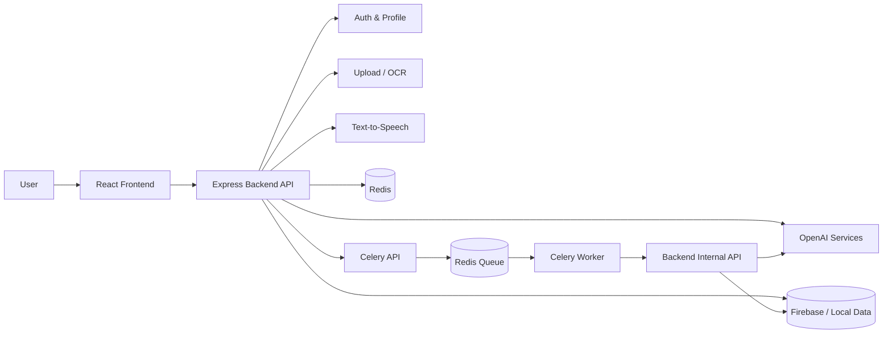
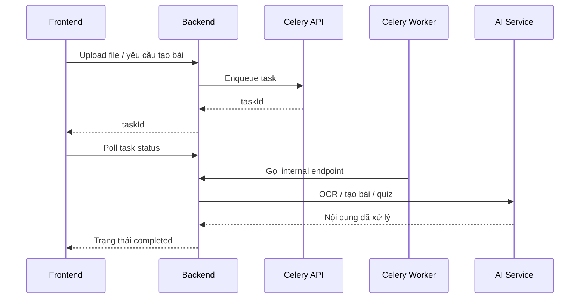

<div align="center">

# Edumentor

### Nền tảng học tập AI cho học sinh THPT Việt Nam

Biến tài liệu học tập thành bài giảng dễ hiểu, quiz luyện tập, lộ trình cá nhân và audio bài học bằng AI.


[Tính năng](#-tính-năng-nổi-bật) ·
[Cài đặt](#-cài-đặt-nhanh) ·
[Chạy dự án](#-chạy-dự-án) ·
[API](#-api-chính) ·
[Debug](#-debug-nhanh)

</div>

---

## Tổng Quan

Edumentor là một web app học tập dùng AI, tập trung vào trải nghiệm học nhanh, dễ hiểu và cá nhân hóa. Người học có thể upload sách giáo khoa/tài liệu, để AI tạo bài giảng, sinh quiz, giải thích kiến thức, tạo lộ trình học và chuyển bài học thành audio.

Project gồm:

| Thành phần | Vai trò |
|---|---|
| `frontend` | React app, giao diện học tập, dashboard, quiz, chat AI |
| `backend` | Express API, auth, upload, OCR, lesson, quiz, TTS, roadmap |
| `celery` | Hàng đợi xử lý nền cho tác vụ dài |
| `cloudflare` | Cấu hình Cloudflare Tunnel khi deploy public |

---

## Tính Năng Nổi Bật

| Nhóm | Tính năng |
|---|---|
| AI Lesson | Tạo bài giảng từ nội dung upload, chuẩn hóa nội dung dễ đọc |
| Upload & OCR | Upload PDF/ảnh/tài liệu, OCR tiếng Việt và tiếng Anh |
| Quiz AI | Sinh quiz, chấm điểm, xem giải thích, tạo lại quiz |
| AI Tutor | Chat hỏi đáp kiến thức, hỗ trợ ảnh bài tập |
| Text-to-Speech | Tạo audio bài học, cache audio, đọc bài giảng |
| Roadmap | Phân tích điểm yếu, tạo lộ trình học cá nhân |
| Dashboard | Theo dõi tiến độ, streak, điểm trung bình, nhiệm vụ hằng ngày |
| Admin | Quản lý user, bài học, quiz, chat, roadmap, log hệ thống |

---

## Kiến Trúc



Luồng xử lý bài học dài:



---

## Tech Stack

| Layer | Công nghệ |
|---|---|
| Frontend | React 18, React Router, React Query, Tailwind CSS, Framer Motion, Recharts |
| Backend | Node.js, Express, Firebase Admin, Multer, Helmet, Morgan, Compression |
| AI | OpenAI API, prompt xử lý bài học/quiz/roadmap/TTS |
| OCR | Tesseract.js, pdf-parse, pdf2pic, Sharp, Jimp |
| Queue | Celery, FastAPI, Redis |
| Auth | Email/password, Google OAuth, Firebase service account |
| Deploy | Cloudflare Tunnel, static frontend build served by backend |

---

## Yêu Cầu Hệ Thống

- Node.js `18+`
- npm
- Python `3.10+` nếu dùng Celery
- Redis nếu dùng queue/cache
- OpenAI API key
- Firebase service account
- Google OAuth Client ID nếu bật đăng nhập Google

---

## Cài Đặt Nhanh

```powershell
git clone <repo-url>
cd AII
```

Cài backend:

```powershell
cd backend
npm install
copy .env.example .env
```

Cài frontend:

```powershell
cd ../frontend
npm install
copy .env.example .env
```

Cài Celery nếu cần xử lý nền:

```powershell
cd ../celery
python -m venv .venv
.\.venv\Scripts\activate
pip install -r requirements.txt
copy .env.example .env
```

Sau khi copy, mở các file `.env` và điền key thật.

---

## Cấu Hình Môi Trường

### Backend

File: `backend/.env`

```env
PORT=5000
NODE_ENV=development

OPENAI_API_KEY=your_openai_api_key_here
OPENAI_MODEL=gpt-4
OPENAI_TTS_MODEL=tts-1
OPENAI_TTS_VOICE=nova

FIREBASE_PROJECT_ID=your_firebase_project_id
FIREBASE_PRIVATE_KEY="your_firebase_private_key"
FIREBASE_CLIENT_EMAIL=your_firebase_client_email

FRONTEND_URL=http://localhost:3000
FRONTEND_APP_URL=http://localhost:3000
GOOGLE_CLIENT_ID=your_google_client_id_here

MAX_FILE_SIZE=10485760
UPLOAD_DIR=./uploads

CELERY_API_URL=http://localhost:8001
INTERNAL_API_TOKEN=your_internal_token

REDIS_URL=redis://localhost:6379
REDIS_KEY_PREFIX=edumentor:
```

### Frontend

File: `frontend/.env`

```env
REACT_APP_API_URL=http://localhost:5000/api
REACT_APP_GOOGLE_CLIENT_ID=your_google_client_id_here
```

### Celery

File: `celery/.env`

```env
REDIS_URL=redis://localhost:6379/0
BACKEND_INTERNAL_URL=http://localhost:5000/api/internal/lesson/generate
INTERNAL_API_TOKEN=your_internal_token
WORKER_API_PORT=8001
REQUEST_TIMEOUT_SECONDS=120
```

`INTERNAL_API_TOKEN` ở backend và celery phải giống nhau.

---

## Chạy Dự Án

### Backend

```powershell
cd backend
npm run dev
```

Backend:

```text
http://localhost:5000
```

Health check:

```powershell
curl http://localhost:5000/api/health
```

### Frontend

```powershell
cd frontend
npm start
```

Frontend:

```text
http://localhost:3000
```

### Celery Worker

Cần Redis chạy trước.

Terminal 1:

```powershell
cd celery
.\.venv\Scripts\activate
python -m uvicorn worker_api:app --host 0.0.0.0 --port 8001 --reload
```

Terminal 2:

```powershell
cd celery
.\.venv\Scripts\activate
python -m celery -A celery_app.celery_app worker --loglevel=info --pool=solo
```

### Script Windows

Project có sẵn script khởi động:

```powershell
.\start.ps1
```

Hoặc:

```powershell
.\start.bat
```

Lưu ý: script có thể dừng các process `node`, `python`, `cloudflared` đang chạy để mở lại service.

---

## Build Production

Build frontend:

```powershell
cd frontend
npm run build
```

Chạy backend production local:

```powershell
cd backend
npm start
```

Backend có thể serve frontend build nếu thư mục `frontend/build` tồn tại.

---

## API Chính

Base URL local:

```text
http://localhost:5000/api
```

<details>
<summary><strong>Auth</strong></summary>

| Method | Endpoint | Mô tả |
|---|---|---|
| POST | `/auth/register` | Đăng ký |
| POST | `/auth/login` | Đăng nhập |
| POST | `/auth/logout` | Đăng xuất |
| POST | `/auth/google` | Đăng nhập Google |
| POST | `/auth/forgot-password` | Quên mật khẩu |
| POST | `/auth/reset-password` | Đặt lại mật khẩu |
| POST | `/auth/complete-profile` | Hoàn tất hồ sơ |

</details>

<details>
<summary><strong>Upload, OCR, Lesson</strong></summary>

| Method | Endpoint | Mô tả |
|---|---|---|
| POST | `/upload` | Upload một file |
| POST | `/upload/multiple` | Upload nhiều file |
| GET | `/upload/status/:fileId` | Xem trạng thái file |
| POST | `/ocr` | OCR từ nội dung/file |
| POST | `/ocr/image` | OCR ảnh |
| POST | `/lesson` | Tạo bài học |
| POST | `/lesson/queue` | Tạo bài học qua queue |
| POST | `/lesson/json` | Tạo bài học có cấu trúc |
| POST | `/lesson/complete` | Tạo bài học hoàn chỉnh |
| GET | `/lessons/:userId` | Danh sách bài học |
| GET | `/lesson/:lessonId` | Chi tiết bài học |
| PUT | `/lesson/:lessonId/complete` | Đánh dấu hoàn thành |

</details>

<details>
<summary><strong>Quiz</strong></summary>

| Method | Endpoint | Mô tả |
|---|---|---|
| POST | `/quiz` | Sinh quiz |
| POST | `/quiz/submit` | Nộp quiz |
| POST | `/quiz/regenerate` | Tạo lại quiz |
| GET | `/quizzes/:userId` | Danh sách quiz |
| GET | `/quiz/:quizId` | Chi tiết quiz |
| GET | `/quiz-history/:userId` | Lịch sử quiz |
| GET | `/quiz-result/:quizId` | Kết quả quiz |

</details>

<details>
<summary><strong>AI Tutor, TTS, Roadmap</strong></summary>

| Method | Endpoint | Mô tả |
|---|---|---|
| POST | `/chat` | Chat với AI |
| POST | `/chat/image` | Chat kèm ảnh |
| GET | `/chat-history/:userId` | Lịch sử chat |
| POST | `/ai/custom` | Yêu cầu AI tùy chỉnh |
| GET | `/tts/voices` | Danh sách voice |
| POST | `/tts` | Tạo audio |
| POST | `/tts/read-aloud` | Đọc nội dung |
| POST | `/tts/lesson` | Tạo audio bài học |
| GET | `/dashboard/:userId` | Dashboard học tập |
| GET | `/roadmap/:userId` | Lộ trình học |
| POST | `/roadmap/generate` | Tạo lộ trình |
| POST | `/study-plan/generate` | Tạo kế hoạch học |

</details>

---

## Cấu Trúc Thư Mục

```text
AII/
├── backend/
│   ├── controllers/
│   ├── middleware/
│   ├── routes/
│   ├── services/
│   ├── uploads/
│   ├── audio/
│   └── server.js
├── frontend/
│   ├── src/
│   │   ├── components/
│   │   ├── pages/
│   │   ├── services/
│   │   ├── context/
│   │   └── utils/
│   └── package.json
├── celery/
│   ├── celery_app.py
│   ├── tasks.py
│   ├── worker_api.py
│   └── requirements.txt
├── cloudflare/
├── uploads/
├── logs/
└── README.md
```

---

## Debug Nhanh

| Lỗi | Cách kiểm tra |
|---|---|
| Frontend không gọi được backend | Kiểm tra `REACT_APP_API_URL`, backend port `5000`, CORS `FRONTEND_URL` |
| Upload lỗi | Kiểm tra `MAX_FILE_SIZE`, quyền ghi thư mục upload, định dạng file |
| OCR lỗi | Kiểm tra file đầu vào, log backend, dependency xử lý PDF/ảnh |
| Tạo bài/quiz lỗi | Kiểm tra `OPENAI_API_KEY`, model, nội dung đầu vào và log backend |
| Audio lỗi | Kiểm tra TTS config, cache audio, endpoint `/tts/status` |
| Celery không chạy | Kiểm tra Redis, `CELERY_API_URL`, `INTERNAL_API_TOKEN`, worker process |

---

## Bảo Mật

- Không commit file `.env`.
- Không đưa OpenAI key, Firebase private key, SMTP password hoặc internal token lên GitHub.
- Khi deploy production, cấu hình đúng `FRONTEND_URL`, `FRONTEND_APP_URL`, CORS và domain public.
- Giữ rate limit và giới hạn upload bật.
- Admin API phải yêu cầu token và quyền admin.

---

## License

MIT. Xem chi tiết trong [LICENSE](LICENSE).

